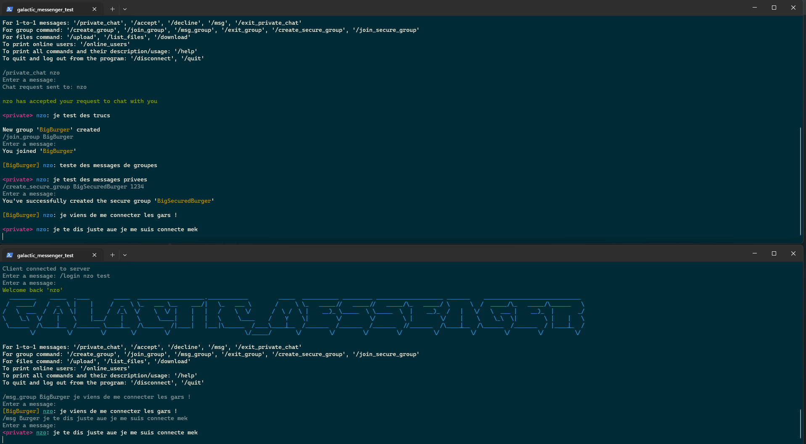
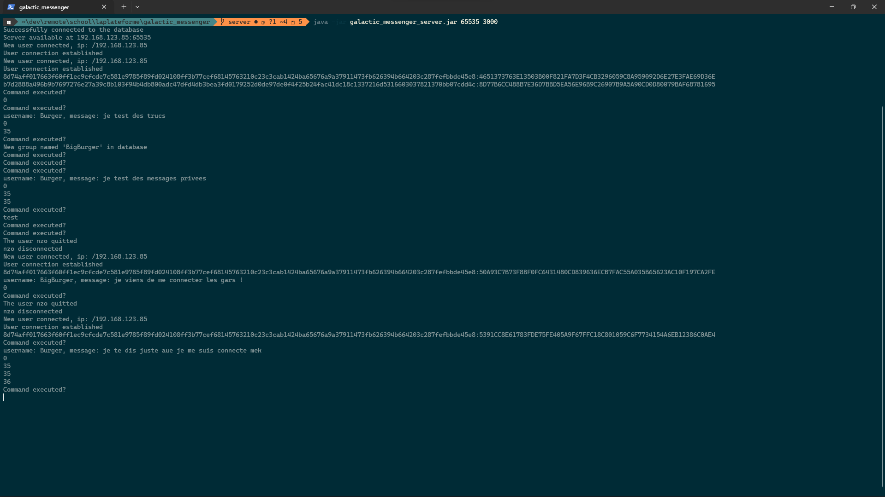

# <p align="center">**Galactic Messenger**</p>


### __Requirements__


- JDK 17+
- MySQL and the corresponding database from ``galactic_messenger.sql``
  <br></br>


### Installation

- git clone
```
git clone https://github.com/pelayo-joel/galactic_messenger.git
```
- [JDK](https://www.oracle.com/fr/java/technologies/downloads/)
- [MySQL](https://dev.mysql.com/downloads/installer/)
  - Run the ``galactic_messenger.sql`` or create the database with same name and tables 

<br></br>


## <p align="center">**Presentation**</p>
---
<div align="center">
</div>

<p align="center">Small command line application that simulates a chat server. The program handles user registration/login, private messages, group/secure group messages and other features.
The repo here holds both the client and the server app.</p>
<br></br>

### **Details**
- The structure splits the client and the server as subprojects to get both jars as independent apps:
    - ``client``
      - Only contains the client app entry point, everything is handled in it.
    - ``server``
      - ``Server.java`` as the app entry point.
        - ``modules`` holds how the server connection, how it treats each client, the database interaction and how the commands are parsed
          - ``database`` for database connection and interactions. Code here hasn't been polished, repeated code might be present.
          - ``implementations`` for how the received commands from a client are treated 
      <br></br>
- To run the server: ``java -jar galactic_messenger_server.jar arg0 arg1``
    - ``arg0`` specifies on which port you wish to use the server.
    - ``arg1`` specifies the database port, should be your MySQL port that you specified during your MySQL installation (3306 by default).
      <br></br>
- To run the client: ``java -jar galactic_messenger_client.jar arg0``
  - ``arg0`` needs the server port specified on server startup.

<br></br>
- Notes:
    - Many comments are present in the code for further details, you might want to read them to fully understand the project.
    - Some part of the code hasn't been tested/polished, bad code might be present here and there.
    - [<span style="color: red">ISSUE</span>] File transfer does not work, it has been set up server-side but not client-side.
    - [<span style="color: red">ISSUE</span>] Secured group can be created but users can't joined them, the password would always fail for some reason.

<br></br>
### **CREDITS**

- [Pelayo Joel](https://github.com/pelayo-joel)
- [Mattio Enzo](https://github.com/enzo-mattio)
